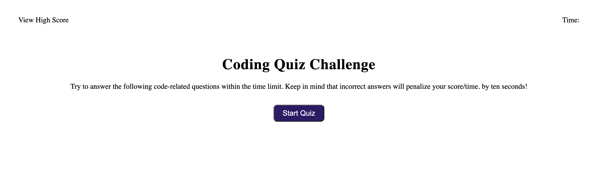

# Quiz Application

## Steps

- Press "Start Quiz" button to start the quiz and timer
- Application loads first question
- Application check's if question answered correctly
- Shows next question
- When all questions done it asks for name and displays the score

## Rules

- Every wrong answer subtracts 10 seconds from timer.

## Page URL

- https://rpliszka1987.github.io/quiz-js/

### Page Image

